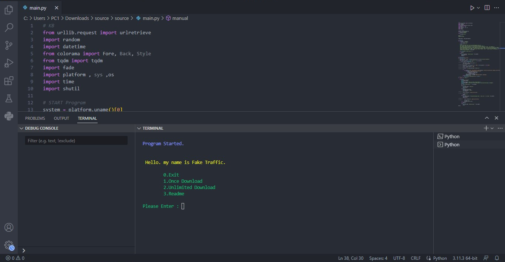

# Preview



_A professional script for SSH Tunnel management, which was built according to Iran's restrictions. Considering that dear Iranians are trying for free internet, I am also trying for a stable service and we support free internet and be sure that filtering has failed!This script has been published with the following features, and please note that to use the script, you only need to send me a message to open its access for you. This access is opened only by announcing your server IP. Please contact me on Telegram._

---

_بارها و بارها دیتاسنتر ها برای _


### Features:
✔️ Check The Log

✔️ Custom Url Download

✔️ Download Speed Control

✔️ Automatic Deletion Of Downloaded Files

✔️ One Time Download Method

✔️ Unlimited Download Method
<br>
<br>
<br>
### Usages:
📌 Prerequisite:
```
from urllib.request import urlretrieve
import random
import datetime
from colorama import Fore, Back, Style
from tqdm import tqdm
import fade
import platform , sys ,os
import time
import shutil
```
<b>Note:</b> Please complete the prerequisites via the pip install command.
<br>
<br>
<br>
📌 Stating Software:
```
https://www.python.org/ftp/python/3.11.3/python-3.11.3-amd64.exe
```
<b>Note:</b> Please Install Python 3.11.3 And Vs Code.
<br>
<br>
<br>

**Copyright &copy; [@InternetCables](https://t.me/InternetCables) Please through this link [Sponsors](https://github.com/InternetCables/Fake-Traffic/blob/main/.github/sponsors.yml) Support me!**
<br>
**Telegram Support: [@InternetCables](https://t.me/InternetCables)**

